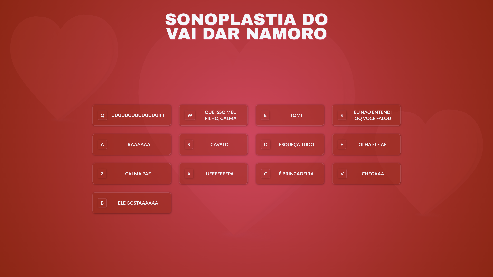

<h1 align="center">
  Sonoplastia do vai dar namoro
</h1>

  
  
  
  
  

  
  
  

  

## 💻 Projeto
Este projeto é um tutorial que ensina a criar uma interface com a sonoplastia do programa **Vai dar Namoro**. O foco da aplicação é apreender a manipular o objeto [Audio](https://developer.mozilla.org/en-US/docs/Web/API/HTMLAudioElement/Audio) do _JavaScript_ a partir do clique em botões ou dos eventos do teclado e também criar uma interface agradável com _HTML_ e _CSS_.

[Clique aqui](https://sonoplastia.leonardovargas.dev/) para acessar a aplicação.

## 🚀 Tecnologias

- HTML
- CSS
- JavaScript

## 📔 Conhecimentos abordados

- [x]  Uso semântico do HTML.
- [x]  Uso de variáveis globais no `:root`.
- [x]  Uso de `flex:grid` para orientar os elementos.
- [x]  Carregando os dados de um arquivo **JSON** em uma variável.
- [x]  Manipulando o objeto `Audio` do _JavaScript_.
- [x]  Criação de elementos dinâmicos com o uso do `createElement`.

## 📺 Tutorial no Youtube

